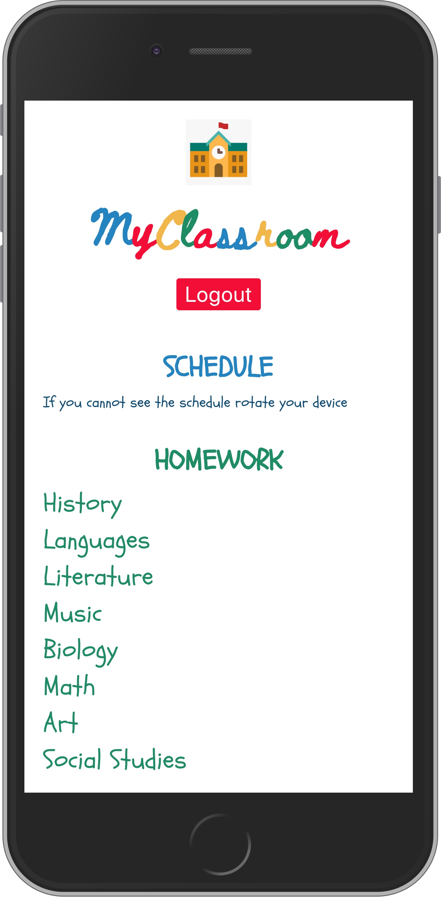
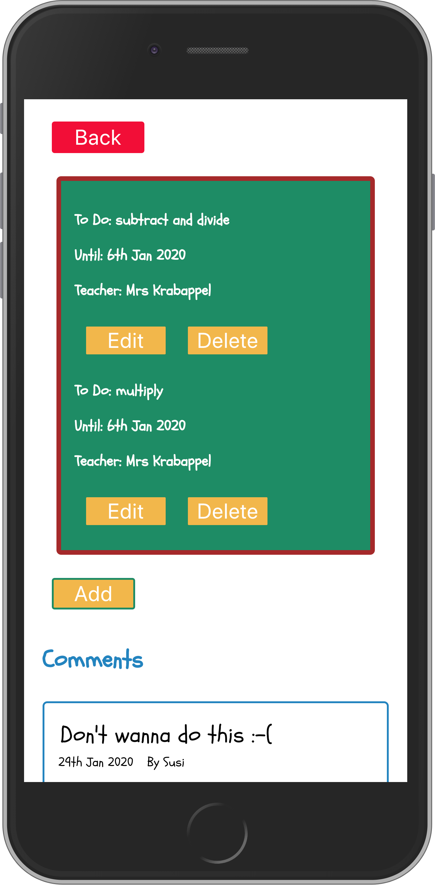
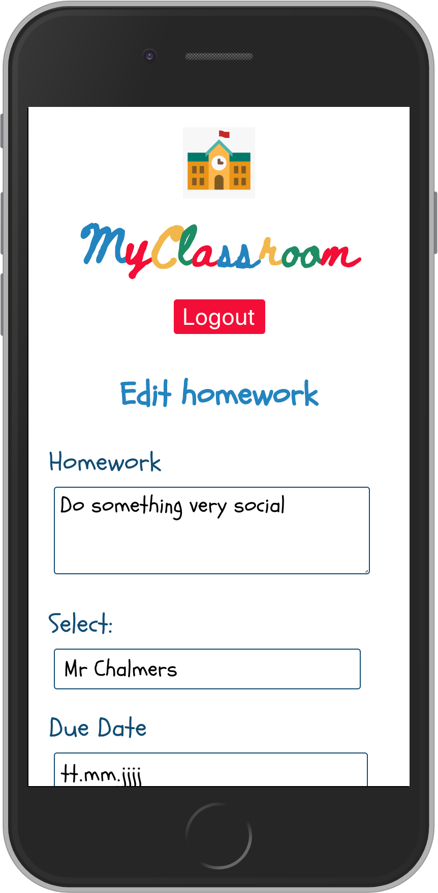
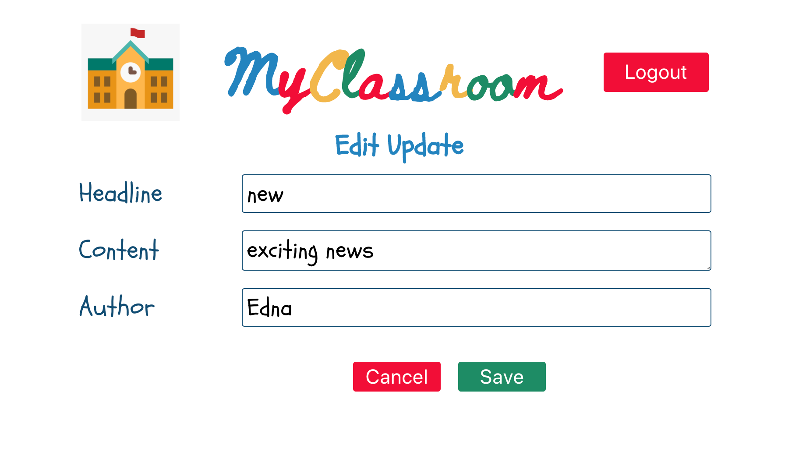

<h1>My Classroom</h1>

<h2>Live: kirstens-classroom-app.now.sh</h2>

<h1>Description</h1>

'My Classroom' helps teachers, parents and students to organize everyday school life. Students and parents can look up homework, announcements, and general information concerning the class and either comment on it or contact the class teacher directly. Teachers have the possibilty to add or change homework as well as communication changes to the schedule or set dates for class trips, parents days etc.

<h1>Motivation</h1>

There is nothing more frustrating than coming to school early in the morning only to find out that the first lessons are canceled. So why not creating an easy way to inform parents and kids BEFORE they get on their way to school like a digital black board. 

<h1>Features</h1>

The App consists of three basic features:

1. Schedule
2. Homework
3. Updates

and has three different user types: teacher, parent and student

Students: can comment on homework and latest updates

Parents: can additionally contact the class teacher

Teachers: are able to add, change and delete existing content whether it is homework or updates

<h1>Start page:</h1>

 
 

<h1>Registration:</h1>

<h1>Login:</h1>

<h1>Dashboard:</h1>

<h3>Schedule on mobile version is only displayed in widescreen mode</h3>

<h3>Parent (email-link) and teacher (add update button) version:<h3>

<h1>Homework:</h1>

Teacher view:

Parent/student view:

Teacher only: add homework

Teacher only: edit homework

<h1>Update:</h1>

Teacher view:

Parent/student view:

Teacher only: add update

Teacher only: edit update

<h1>Add Comment:</h1>

<h1>Parent only: write email</h1>

Built with:

React

